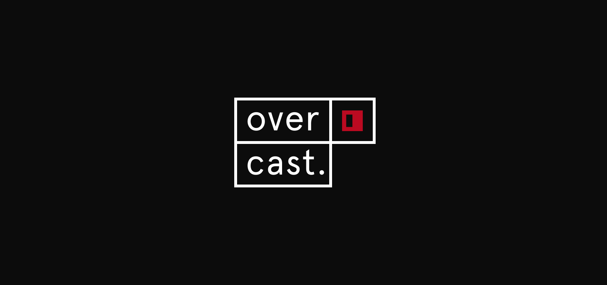

Overcast
======


**A beautiful and powerful
End to end encryption for facebook messenger.**
A desktop app for easy and out of sight secure communication. Sign-in with facebook and... Built on electron and axolotl––a ratcheting forward secrecy [protocol](https://github.com/trevp/double_ratchet/wiki) inspired by Open Whisper Systems.

## Download Overcast
The project is still a 👶 and needs a little more nutrition.

## Your Data Matters
Protect it. 'This message is for you and nobody else. Not facebook. Not the NSA. Nobody.'

## Move With Us
Clone the repository:
```$ git clone https://github.com/moonfruits/overcast.git```

Install the dependencies:
* [Axolotl](https://github.com/joebandenburg/libaxolotl-javascript)
* Electron binaries
* Mongodb 

To package and build overcast:
```npm install package.js```
(Once we actually have a package.js)

## The Road Ahead
Dual-functionality as a keychain, etc. etc.
Feature requests.
Make secure communication mainstream.