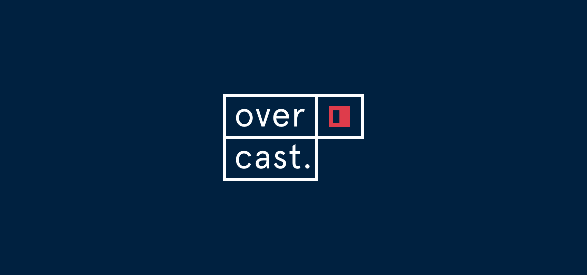

Overcast
======


**We're making secure communication easier.**
Overcast is an open source desktop app that combines the security of end-to-end encryption with Facebook messenger's ease of use. Simply login with Facebook and voila: convenient, secure, and reliable messaging.* Built on electron and axolotl––an implementation of Open Whisper System's [forward secrecy protocol](https://whispersystems.org/docs/specifications/doubleratchet/doubleratchet.pdf).

*Stolen from Whatsapp lol

## Download Overcast
The project is still a 👶 and requires a little more care before going live. Be on the lookout for some first words.

## Your Data Matters
* Everybody has secrets. Protect them.
* While Facebook supports optional end-to-end encryption for the messenger app, they still hold your private keys. Take back your private keys.
* With overcast, you are in control. Facebook can't read your messages, only you and who you're talking to.
* A smarter way to use Facebook messenger. 
* Encrypted by default, overcast is the easiest way to avoid surveillance.

## Move With Us
Clone the repository:
```$ git clone https://github.com/moonfruits/overcast.git```

Install the dependencies:
* [Axolotl](https://github.com/joebandenburg/libaxolotl-javascript)
* Electron binaries
* Mongodb (testing locally, for now)

To package and build overcast:
```npm install package.js```
(Once we actually have a package.js)

## The Road Ahead
* Dual-functionality as a keychain, first PGP keychain to have FB authentication, etc.
* Feature requests (contact [me](http://m.me/shobrookj/))
* Let's make secure communication mainstream